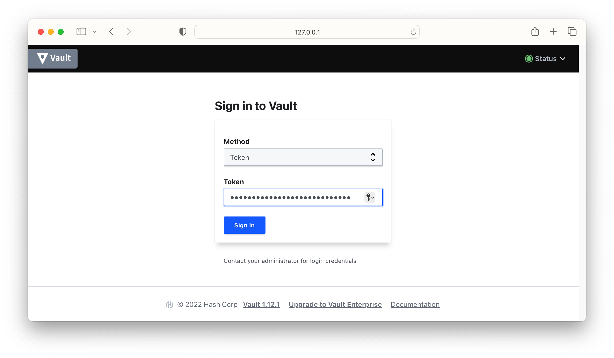

# Solution

Follow the instructions on the Vault page to install the binary. Verify that Vault has been installed properly. As shown in the output below, Vault 1.12.1 has been installed.

```
$ vault version
Vault v1.12.1 ('e34f8a14fb7a88af4640b09f3ddbb5646b946d9c+CHANGES'), built 2022-10-27T12:32:05Z
```

The `-help` and `-h` command line options render the usage pattern of the executable. You will get the same output if you just run the `vault` command.

```
$ vault -help
Usage: vault <command> [args]

Common commands:
    read        Read data and retrieves secrets
    write       Write data, configuration, and secrets
    delete      Delete secrets and configuration
    list        List data or secrets
    login       Authenticate locally
    agent       Start a Vault agent
    server      Start a Vault server
    status      Print seal and HA status
    unwrap      Unwrap a wrapped secret

Other commands:
    audit                Interact with audit devices
    auth                 Interact with auth methods
    debug                Runs the debug command
    kv                   Interact with Vault's Key-Value storage
    lease                Interact with leases
    monitor              Stream log messages from a Vault server
    namespace            Interact with namespaces
    operator             Perform operator-specific tasks
    path-help            Retrieve API help for paths
    plugin               Interact with Vault plugins and catalog
    policy               Interact with policies
    print                Prints runtime configurations
    secrets              Interact with secrets engines
    ssh                  Initiate an SSH session
    token                Interact with tokens
    version-history      Prints the version history of the target Vault server
```

Start the local development server with the following command. As you can see in the output, the URL is `http://127.0.0.1:8200`, the root token is `hvs.1dx0yCjCNZFQQOfUljLyRukq`.

```
$ vault server -dev
...
WARNING! dev mode is enabled! In this mode, Vault runs entirely in-memory
and starts unsealed with a single unseal key. The root token is already
authenticated to the CLI, so you can immediately begin using Vault.

You may need to set the following environment variables:

    $ export VAULT_ADDR='http://127.0.0.1:8200'

The unseal key and root token are displayed below in case you want to
seal/unseal the Vault or re-authenticate.

Unseal Key: 9RTyd8gBLtfUXWG3mp/dl23CWfe1Xe+0/BQ62bSBOk0=
Root Token: hvs.1dx0yCjCNZFQQOfUljLyRukq

Development mode should NOT be used in production installations!
```

Export the Vault URL and root token as environment variables.

```
$ export VAULT_ADDR='http://127.0.0.1:8200'
$ export VAULT_TOKEN=hvs.1dx0yCjCNZFQQOfUljLyRukq
```

Open a browser and enter the URL `http://127.0.0.1:8200`. That will bring up the Vault UI. Use the "Token" authentication method. Enter the root token value into the field "Token". Pressing the "Sign In" button will successfully log you into Vault.



You can make a call to the API using the `curl` command. Make sure to set the root token as a header. Use the Vault address that points to the local development server.

```
$ curl -H "X-Vault-Token: $VAULT_TOKEN" -X GET $VAULT_ADDR/v1/sys/host-info
{"request_id":"c96b4c0e-bc38-b638-1864-e1c2e30c1e7e","lease_id":"","renewable":false,"lease_duration":0,"data":{"cpu":[{"cpu":0,"vendorId":"GenuineIntel","family":"6","model":"158","stepping":13,"physicalId":"","coreId":"","cores":8,"modelName":"Intel(R) Core(TM) i9-9980HK CPU @ 2.40GHz","mhz":2400,"cacheSize":256,"flags":["fpu","vme","de","pse","tsc","msr","pae","mce","cx8","apic","sep","mtrr","pge","mca","cmov","pat","pse36","clfsh","ds","acpi","mmx","fxsr","sse","sse2","ss","htt","tm","pbe","sse3","pclmulqdq","dtes64","mon","dscpl","vmx","est","tm2","ssse3","fma","cx16","tpr","pdcm","sse4.1","sse4.2","x2apic","movbe","popcnt","aes","pcid","xsave","osxsave","seglim64","tsctmr","avx1.0","rdrand","f16c","rdwrfsgs","tsc_thread_offset","sgx","bmi1","avx2","smep","bmi2","erms","invpcid","fpu_csds","mpx","rdseed","adx","smap","clfsopt","ipt","sgxlc","mdclear","ibrs","stibp","l1df","acapmsr","ssbd","syscall","xd","1gbpage","em64t","lahf","lzcnt","prefetchw","rdtscp","tsci"],"microcode":""}],"disk":[{"path":"/","fstype":"apfs","total":2000796545024,"free":1733629157376,"used":267167387648,"usedPercent":13.353051229144103,"inodesTotal":4292537898,"inodesUsed":502068,"inodesFree":4292035830,"inodesUsedPercent":0.011696297433598105},{"path":"/dev","fstype":"devfs","total":198144,"free":0,"used":198144,"usedPercent":100,"inodesTotal":670,"inodesUsed":670,"inodesFree":0,"inodesUsedPercent":100},{"path":"/System/Volumes/VM","fstype":"apfs","total":2000796545024,"free":1733629157376,"used":267167387648,"usedPercent":13.353051229144103,"inodesTotal":16929972244,"inodesUsed":4,"inodesFree":16929972240,"inodesUsedPercent":2.3626736903940312e-8},{"path":"/System/Volumes/Preboot","fstype":"apfs","total":2000796545024,"free":1733629157376,"used":267167387648,"usedPercent":13.353051229144103,"inodesTotal":16929977412,"inodesUsed":5172,"inodesFree":16929972240,"inodesUsedPercent":0.000030549361491374915},{"path":"/System/Volumes/Update","fstype":"apfs","total":2000796545024,"free":1733629157376,"used":267167387648,"usedPercent":13.353051229144103,"inodesTotal":16929972258,"inodesUsed":18,"inodesFree":16929972240,"inodesUsedPercent":1.0632031597981134e-7},{"path":"/System/Volumes/Data","fstype":"apfs","total":2000796545024,"free":1733629157376,"used":267167387648,"usedPercent":13.353051229144103,"inodesTotal":16932256587,"inodesUsed":2284347,"inodesFree":16929972240,"inodesUsedPercent":0.013491096052453177},{"path":"/System/Volumes/Data/home","fstype":"autofs","total":0,"free":0,"used":0,"usedPercent":0,"inodesTotal":0,"inodesUsed":0,"inodesFree":0,"inodesUsedPercent":0}],"host":{"hostname":"ascent.local","uptime":3015847,"bootTime":1666636149,"procs":690,"os":"darwin","platform":"darwin","platformFamily":"Standalone Workstation","platformVersion":"12.6","kernelVersion":"21.6.0","kernelArch":"x86_64","virtualizationSystem":"","virtualizationRole":"","hostid":"07d34ca1-6e03-5efb-ad0a-36e490827daa"},"memory":{"total":68719476736,"available":40838901760,"used":27880574976,"usedPercent":40.57157635688782,"free":23292813312,"active":16516403200,"inactive":17546088448,"wired":5833060352,"laundry":0,"buffers":0,"cached":0,"writeback":0,"dirty":0,"writebacktmp":0,"shared":0,"slab":0,"sreclaimable":0,"sunreclaim":0,"pagetables":0,"swapcached":0,"commitlimit":0,"committedas":0,"hightotal":0,"highfree":0,"lowtotal":0,"lowfree":0,"swaptotal":0,"swapfree":0,"mapped":0,"vmalloctotal":0,"vmallocused":0,"vmallocchunk":0,"hugepagestotal":0,"hugepagesfree":0,"hugepagesize":0},"timestamp":"2022-11-28T16:13:16.64764Z"},"wrap_info":null,"warnings":["cpu_times: not implemented yet"],"auth":null}
```

Congratulations! You are ready to use the Vault in the next exercises.