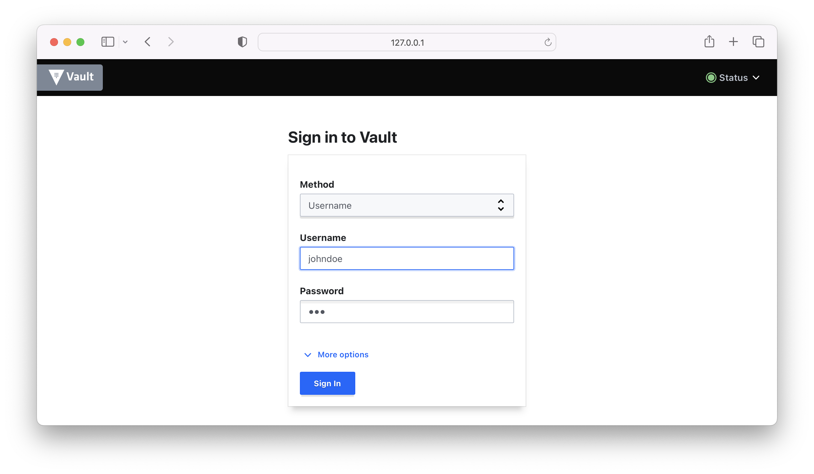

# Solution

Use the `login` command to log in with the authentication method of type Userpass. Here, we are setting the `userpass` method and provide the `username` parameter for the user `johndoe`. The command will return a client token you can use for calls to the API.

```
$ vault login -method=userpass username=johndoe
Password (will be hidden):
WARNING! The VAULT_TOKEN environment variable is set! The value of this
variable will take precedence; if this is unwanted please unset VAULT_TOKEN or
update its value accordingly.

Success! You are now authenticated. The token information displayed below
is already stored in the token helper. You do NOT need to run "vault login"
again. Future Vault requests will automatically use this token.

Key                    Value
---                    -----
token                  hvs.CAESIPz3LATfaO-jqmfcpK2yn2dI9r31MDID7CMTtaaePbf0Gh4KHGh2cy5ZU2plVzhmQVRIUDRpSFUzQjFtdEpGb24
token_accessor         HUguw48LAa5Bjmh8z6N0VXGw
token_duration         768h
token_renewable        true
token_policies         ["default"]
identity_policies      []
policies               ["default"]
token_meta_username    johndoe
```

The client token for the Userpass authentication method is `hvs.CAESIPz3LATfaO-jqmfcpK2yn2dI9r31MDID7CMTtaaePbf0Gh4KHGh2cy5ZU2plVzhmQVRIUDRpSFUzQjFtdEpGb24`. Provide the token in the header of a `curl` command. The response body provides information about a key-value store backend.

```
$ curl -H "X-Vault-Token: hvs.CAESIPz3LATfaO-jqmfcpK2yn2dI9r31MDID7CMTtaaePbf0Gh4KHGh2cy5ZU2plVzhmQVRIUDRpSFUzQjFtdEpGb24" $VAULT_ADDR/v1/secret\?help\=1
...
```

You can sign in with either the "Username" method or the generated token for the Userpass authentication method. The screenshot below shows the sign in shows the usage of the "Username" method.



You can find the sign out option in the drop down menu in the top-right corner. Select "Sign out". You will be redirected to the sign in screen.


Run the `login` command with the root token to sign back in.

```
$ vault login -address=$VAULT_ADDR $VAULT_TOKEN
WARNING! The VAULT_TOKEN environment variable is set! The value of this
variable will take precedence; if this is unwanted please unset VAULT_TOKEN or
update its value accordingly.

Success! You are now authenticated. The token information displayed below
is already stored in the token helper. You do NOT need to run "vault login"
again. Future Vault requests will automatically use this token.

Key                  Value
---                  -----
token                hvs.1dx0yCjCNZFQQOfUljLyRukq
token_accessor       6UqLKI9h3mCIWZrUkRFj2s2Z
token_duration       ∞
token_renewable      false
token_policies       ["root"]
identity_policies    []
policies             ["root"]
```

There are two calls you need to make from the CLI to retrieve the role ID and secret ID for the named AppRole `global`. The first call returns the role ID, the second call generates a secret ID.

```
$ vault read auth/global/role/servicebot/role-id
Key        Value
---        -----
role_id    6202f935-b1e3-f2cc-0e6f-b0b42233ae84
$ vault write -force auth/global/role/servicebot/secret-id
Key                   Value
---                   -----
secret_id             aeece79d-a75a-7230-3720-d7c71d0c3281
secret_id_accessor    e1901819-4f30-54d2-0d94-cc9b84154f4b
secret_id_num_uses    0
secret_id_ttl         0s
```

You can now log in with the role ID and secret ID. The call will provide you with the client token.

```
$ vault write auth/global/login role_id=6202f935-b1e3-f2cc-0e6f-b0b42233ae84 secret_id=aeece79d-a75a-7230-3720-d7c71d0c3281
WARNING! The following warnings were returned from Vault:

  * TTL of "768h" exceeded the effective max_ttl of "30m"; TTL value is capped
  accordingly

Key                     Value
---                     -----
token                   hvs.CAESIAy6eh7Oe6I4p5U-8jGhjsublDl-xM-wnvnD-hsg8mjwGh4KHGh2cy54R0xQVVR0d0VUSVpFTkVDRUhSQUs3R1Q
token_accessor          AMqtjjMZueHfb2g3HFvmlvC3
token_duration          30m
token_renewable         true
token_policies          ["default"]
identity_policies       []
policies                ["default"]
token_meta_role_name    servicebot
```

We can use the client token to make a call to the API endpoint. This token will be valid for 30 minutes.

```
$ curl -H "X-Vault-Token: hvs.CAESIAy6eh7Oe6I4p5U-8jGhjsublDl-xM-wnvnD-hsg8mjwGh4KHGh2cy54R0xQVVR0d0VUSVpFTkVDRUhSQUs3R1Q" $VAULT_ADDR/v1/secret\?help\=1
...
```