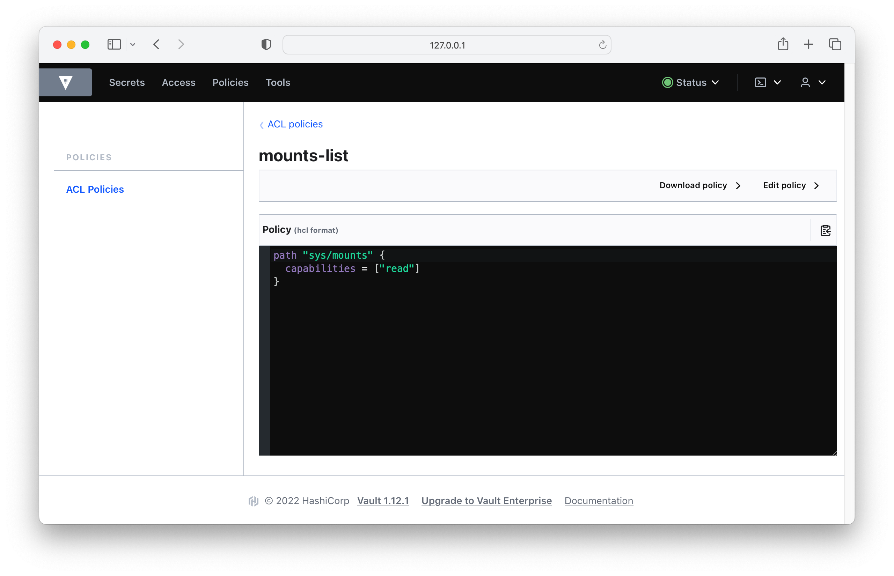

# Solution

Run the `login` command with the root token to sign in.

```
$ vault login -address=$VAULT_ADDR $VAULT_TOKEN
WARNING! The VAULT_TOKEN environment variable is set! The value of this
variable will take precedence; if this is unwanted please unset VAULT_TOKEN or
update its value accordingly.

Success! You are now authenticated. The token information displayed below
is already stored in the token helper. You do NOT need to run "vault login"
again. Future Vault requests will automatically use this token.

Key                  Value
---                  -----
token                hvs.1dx0yCjCNZFQQOfUljLyRukq
token_accessor       6UqLKI9h3mCIWZrUkRFj2s2Z
token_duration       ∞
token_renewable      false
token_policies       ["root"]
identity_policies    []
policies             ["root"]
```

List the current policies shows the `default` and `root` policy.

```
$ vault policy list
default
root
```

Create the policy file named `secrets-list.hcl` and add the following contents.

```hcl
path "sys/mounts" {
  capabilities = ["read"]
}
```

Before creating a policy from the HCL file, format its contents to follow the style conventions. Use the `policy fmt` command to achieve the automatic formatting of the file.

```
$ vault policy fmt secrets-list.hcl
Success! Formatted policy: secrets-list.hcl
```

Create the policy using the `policy write` command and point to the HCL file.

```
$ vault policy write secrets-list secrets-list.hcl
Success! Uploaded policy: secrets-list
```

List the policies again. The new policy will be rendered as part of the policy list.

```
$ vault policy list
default
secrets-list
root
```

At any time, you can have a look at the rules of a policy with the `policy read` command. The output of the command will simply render the contents of the uploaded HCL file.

```
$ vault policy read secrets-list
path "sys/mounts" {
  capabilities = ["read"]
}
```

You can find the list of policies under the menu item "Policies".


For details, simply click on the policy name. To edit the policy, click the option "Edit policy".



You can directly edit the policy from the UI. Press the "Save" button to let the changes take effect.


Alternatively, you can also update the policy from the CLI. First, you need to modify the policy file and then use the `policy write` command to apply the changes.

```
$ vault policy write secrets-list secrets-list.hcl
Success! Uploaded policy: secrets-list
```